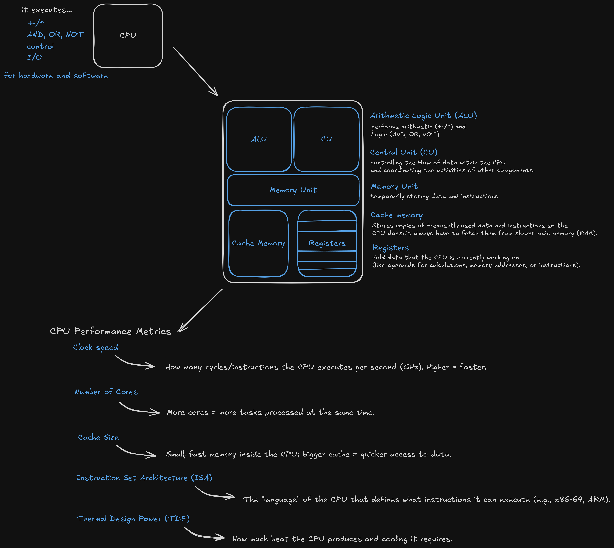

The CPU = the **brain** of the computer.  
It doesn’t do everything, but it **tells everything what to do** and runs instructions in a loop.

---

## 🧩 What’s inside (the way I remember it)

<figure style="text-align:center;">
  
  <figcaption>Meu “cheat sheet” da CPU — peças internas e como a galera mede performance.</figcaption>
</figure>

- **ALU** → the **hands**. Does math and logic (add, compare, AND/OR).  
- **Control Unit** → the **recipe book / traffic cop**. Tells parts *what* to do and *when*.  
- **Registers** → tiny **bowls** on the table. Hold the numbers the CPU is using **right now**.  
- **Cache (L1/L2/L3)** → super-fast **short-term memory** close to the CPU. Keeps frequent stuff handy so it doesn’t wait on RAM.

---

## 📏 How people “measure” a CPU (my quick take)

- **Clock speed (GHz)** → how fast the beat is. Faster isn’t always better, but it helps. 
- **Cores (and threads)** → each core is a brain, more brains = better for multitasking.  
- **ISA** → the CPU’s **language**.  
  Common ones: **x86-64** (Intel/AMD PCs) and **ARM** (phones + Apple laptops).  
- **TDP** → heat/power **budget**. Tells me what kind of cooling it expects.

---

## ⚙️ What the CPU actually does (in my head)

**Fetch → Decode → Execute → Repeat.**  
Grab an instruction, figure it out, do it, move on.

---

## 🗒️ Sticky notes to future me

- Don’t obsess over GHz only. **Cores + cache + design** matter a lot.  
- Cache is like a **cheat sheet**. When it misses, the CPU asks **RAM** (slower).  
- It’s **Control Unit** (not “central unit”) — I keep forgetting this.

---

## ❓ Still fuzzy / to revisit later

- How caches decide what to keep/throw away.  
- Threads vs. real cores in real apps.

---

👉 If you’re new here, check out my [Welcome Post](./index.md) to see what this devlog is all about, or peek at [Day 0 of my Cybersec notes](./0_day_cybersec.md).
